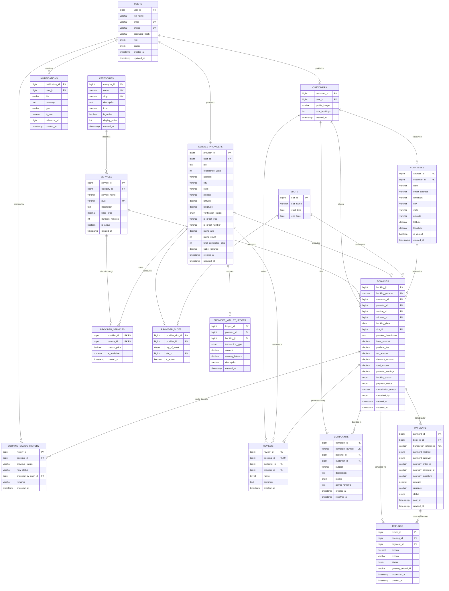

# FixMate - Entity Relationship (ER) Diagram

This document models the relational data architecture of the FixMate platform, highlighting all 17 tables, primary keys, foreign keys, and cardinalities.

